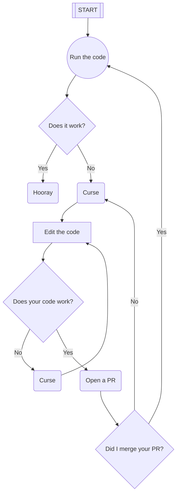

# Simple Rekordbox-Tracklist-Converter
I think it's a bit annoying, that you can't export your tracklist from Rekordbox to a simple text file. So I wrote this little script to do it for you.

## Usage
1. Find the .cue of your recording in your Rekordbox folder (e.g. `C:\Users\YOURUSERNAME\Documents\Rekordbox\Recordings\YOURRECORDING.cue`)
2. Simply run `python rekordbox2text.py --cue YOURRECORDING.cue` in your terminal
3. The script will create a file called `YOURRECORDING.txt` in the same folder as the .cue file

## Modifications
Simply run `python rekordbox2text.py -h` to see all available options.

Output:
```
usage: convert.py [-h] [--cue CUE] [--txt TXT] [--overwrite]

Convert recordbox to txt

optional arguments:
  -h, --help   show this help message and exit
  --cue CUE    tracklist.cue file
  --txt TXT    tracklist.txt file
  --overwrite  overwrite txt file
```

# Workflow for this repo

